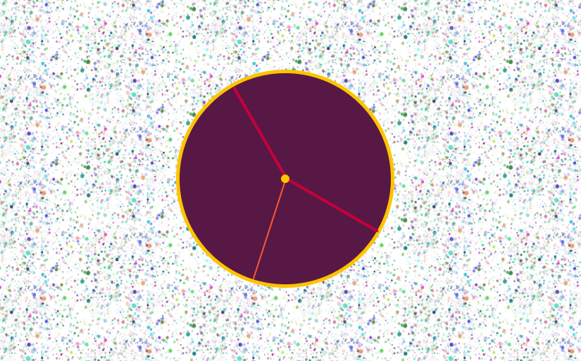

# Analogue Clock

###### August 2020

_I made this clock with a little help from [Wes Bos' JavaScript30](https://wesbos.com/) tutorial although I changed a lot of the CSS design aspects of it to make it my own. I really enjoyed combining CSS and JavaScript to make something really functional._

## Main Learning Points:

- Creating a date object
- Using methods to get information from a date object, eg. `getSeconds() getMinutes() getHours()`
- Using `setInterval` to update the time every second
- Using the CSS property `transform-origin` to make the hands of the clock rotate correctly
- Using CSS variables to make styling easier

## Built with:

- HTML
- CSS
- JavaScript

## Getting Started:

Clone the repo as instructed below

## Prerequisites:

No prerequisites

## Installation

1.  Clone the repo

`git clone https://github.com/katiehawcutt/analogue-clock.git`

2. Run the index.html in a browser

## Usage

Tell the time!
